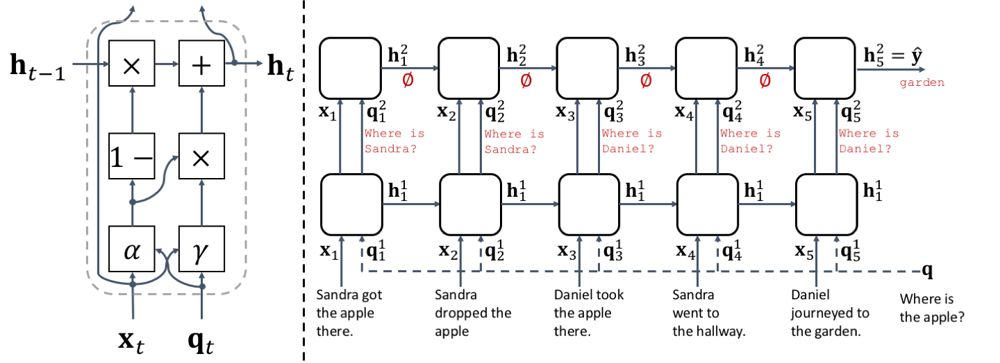
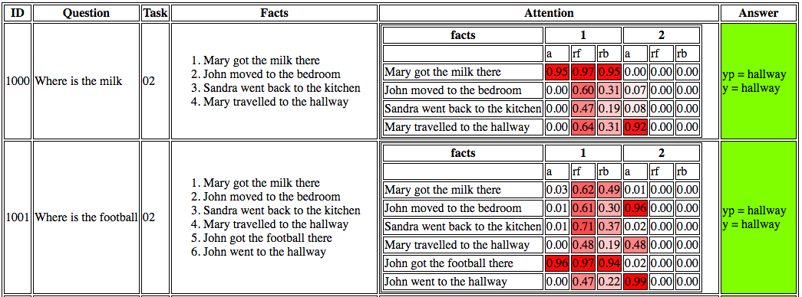

# Query-Reduction Networks (QRN)

[QRN][qrn] is a purely sequential model like LSTM or GRU (but simpler than them) for story-based question answering ([bAbI QA tasks][babi]).
[QRN][qrn] is implemented using [TensorFlow][tensorflow].
Here are some notable results (error rates in %) on bAbI QA dataset:

| Task    | [LSTM][lstm] | [MemN2N][memn2n] | Ours       |
| ------- |:------------:|:----------------:|:----------:|
| 1k avg  | 51.3         | 15.2             | 9.9        |
| 10k avg | 36.4         | 4.2              | 0.3        |

See model details and more results in [this paper][qrn].

## 1. Quick Start
We are assuming you are working in a Linux environment. 
Make sure that you have Python (developed on 3.5), and you installed these Python packages: `tensorflow` (0.8 or higher, get it [here][tensorflow]), and `progressbar2`.

First, download bAbI QA dataset (note that this downloads the dataset to `$HOME/data/babi`):

```bash
chmod +x download.sh; ./download.sh 
```

Then preprocess the data for a particular task, say Task 2 (this stores the preprocessed data in `data/babi/en/02/`):
```bash
python -m prepro --task 2
```

Finally, you train the model (test is automatically performed at the end):
```bash
python -m babi.main --noload --task 2
```
It took ~3 minutes on my laptop using CPU.

You can run it several times with new weight initialization (e.g. 10) and report the test result with the lowest dev loss:
```bash
python -m babi.main --noload --task 2 --num_trials 10
```
This is critical to stably get the reported results; some weight initialization leads to a bad optima.

## 2. Visualizing Results
After training and testing, the result is stored in `evals/babi/en/02-None-00-01/test_0150.json`.
We can visualize the magnitudes of the update and reset gates using the result file.
Note that you need `jinja2` (Python package).
Run the following command to host a web server for visualization and open it via browser:

```bash
python -m babi.visualize_result --task 2 --open True
```

then click the file(s). It takes a a few seconds to load the heatmap coloring of the gate values.
You will see something like this:



By default `visualize_result` retrieves the first trial (1).
If you want to retrieve a particular trial number, specify the trial number if `--trial_num` option.


## 3. 10k and Other Options
To train the model on 10k dataset, first preprocess the data with `large` flag:
```bash
python -m prepro --task 2 --large True
```

Then train the model with `large` flag as well:
```bash
python -m babi.main --noload --task 2 --large True --batch_size 128 --init_lr 0.1 --wd 0.0005 --hidden_size 200
```
Note that the batch size, init_lr, wd, and hidden_size changed.

Finally, visualization requires the `large`  flag:
```bash
python -m babi.visualize_result --task 2 --open True --large True
```

To control other parameters and see other options, type:
```bash
python -m babi.main -h
```

## 4. Run bAbI dialog
To train the model on bAbI dialog, preprocess the data with bAbI dialog dataset:
```bash
python -m prepro-dialog --task 2
```

Then train the model:
```bash
python -m dialog.main --noload --task 2
```

To use match, `use_match` flag is required:
```bash
python -m dialog.main --noload --task 2 --use_match True
```

To use RNN decoder, `use_rnn` flag is required:
```bash
python -m dialog.main --noload --task 2 --use_rnn True
```

[qrn]: http://arxiv.org/abs/1606.04582
[babi]: http://arxiv.org/abs/1502.05698
[lstm]: http://arxiv.org/abs/1502.05698 
[memn2n]: http://arxiv.org/abs/1503.08895
[tensorflow]: https://www.tensorflow.org/
